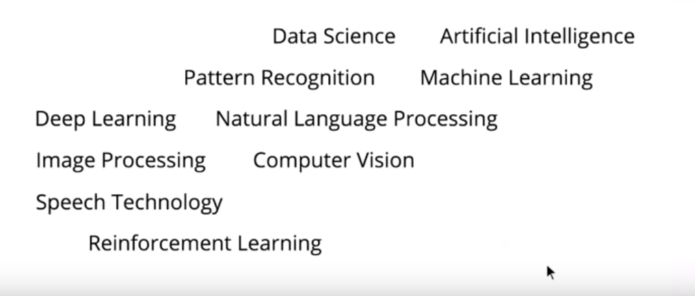
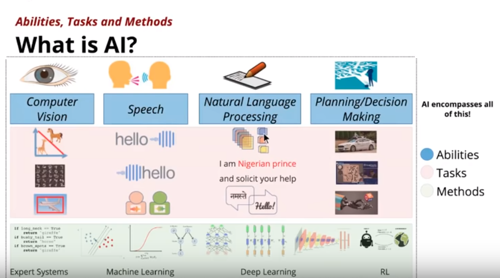
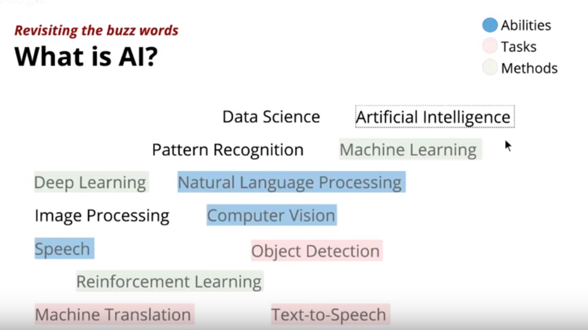
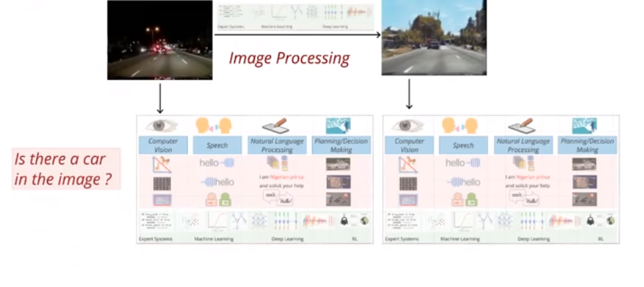

# Part - 1

Hey everyone, so we are resuming with the content. So, today we will try to get a brief overview of what Machine Learning is and better understand what do some different terms mean. This will help you get a clear overview of what you are getting into.

So I am sure anyone who is reading this right now would have come across these words and would want to work on some of these things. But Hey do you know exactly what do they mean or are you just going with the hype. I hope to clear these things today and break some of the jargon revolving around these words. 

So is this JARGON real? Yes for sure. Like one of the most intruiging things for me is why is the Robert Bosch Centre for Data Science and Artificial Intelligence in IIT Madras named so. Why are these two words coming together? Do they mean the same? So I hope by the end of this session, everyone of you can better understand what do these terms mean and differentiate them in case there are any differences. This will also help you identify what your interests are and help you choose what you want to work on. 

## So lets start!

Lets start by having a look at some definitions of these words present on the internet.

**Artificial Intelligence**
*In computer science, artificial intelligence (AI), sometimes called **machine intelligence**, is intelligence demonstrated by machines, in contrast to the natural intelligence displayed by humans and animals. [Source](https://en.wikipedia.org/wiki/Artificial_intelligence)*

**Machine Learning**
*Machine learning (ML) is the scientific study of algorithms and **statistical models** that computer systems use to perform a specific task without using explicit instructions, relying on patterns and inference instead. [Source](https://en.wikipedia.org/wiki/Machine_learning)*

Now does this mean that **AI** doesnt involve statistics? I am sure most of you guys who have looked at **"AI"** tutorials or articles would have come across the word statistics. So are these defintions wrong or do they mean something more.

Lets look at some more

**Data Science**
*Data science is an inter-disciplinary field that uses scientific methods, processes, algorithms and systems to extract knowledge and insights from many structural and unstructured data.[1][2] Data science is related to data mining and big data. [Source](https://en.wikipedia.org/wiki/Data_science)*

Now there are some new words popping here like inter disciplinary, using structured and unstructed data, etc. Now I can easily visualise AI and ML also being interdisciplinary, involves deriving some insights from data, etc. Now these definitions don't exactly highlight the key differences between these words.

**If you still aren't confused, Let me ask you a simple question - Is automatic recogntion of Digits AI or ML or Data Science or Pattern recogntion or Computer Vision or Deep Learning and Why?**

## What is AI?

Lets start by understanding some abilites that humans have. Some of them are see, hear and listen, read and write, make decisions. Now what do these translate to for machines? Computer Vision, Natural Language Processing, Planning and decision making. Now these are some of the **abilities** we would expect from an Aritificial Intelligence System.  

Now these abilities help me perform some **tasks**. Like in case of coputer vision it can be used for detecting objects, classifying them etc. Some NLP tasks include converting voice to text or text to voice etc. Now all these come under this group called tasks.

Now what are the different **methods** to solve these tasks. The most primitive one is expert systems. An expert system is basically a rule based model, where we explicitely define some rules for the model to perform these tasks. Now defining all these tasks is very hard. Thats when Machine Learning comes into play where we give the machine some labelled data and hence allow the model to learn some correlation between the inputs and outputs. Since the last few years the hype has been revolving around a subset of machine learning algorithms called Deep learning. Further on there are methods like Reinforcement Learning, which utilise Deep Learning technicques to make an agent which can perform decision making. Now these are the different methods to solve these tasks. 

**So what is AI? AI encompasses all of them. If someone says he/she is utilising an AI driven system then it means they are using any one of these methods to solve a specific task.**

## Explicitly programmed vs Learning Based systems

Now lets say we have a task to classify animals. In an explicitely programmed system, we give the model certain rules like lets say a giraffe has a long neck, etc to classify animals. So what happens in a learning based system, the machine is given data like for this example images (collection of pixels) and their corresponding labels. Now we tell the machine to identify a hypothetical function F which maps these images to the corresponding labels. Like for example lets say F was a linear function y = mx + c, then the task of the Machine Learning model is to identify the best set of parameters m and c to map the input to the corresponding output. 

So now lets revisit the buzz words we started with. We have identified what most of these things mean and that Artificial intelligence is a broader aspect that encompasses all of them.

Lets continue with the remaining set of words.

## How is pattern recognition related what we saw so far.

*The field of pattern recognition is concerned with the automatic discovery of regularities in data using computer algorithms and with these regularities to take actions such as classifying data in different categories.*

So lets say we want to detect a dog in an image. Now to do this dont we require some pattern recogntion. Similarly lets say we want to detect spam in a text, don't we still need to identify some patterns which lead to a spam classification. So in all the tasks we require pattern recogntion. So these different tasks are different based on the what we do after recognising these patterns. 

**Hence pattern recognition can be defined as identifying some regularities in the data through the use of computer algorithms and with the use of these identified patterns actions like classification, regression, clustering are taken.**

## Is Image processing different from Computer Vision. 

Lets say we want to detect cars in an image. Now if we had an image in the night then it is not possible even for humans to identify all the cars in such an image. This makes it hard for computers as well. Image processing is basically used to aid a computer to identify an image by doing some preprocessing before passing it onto a computer vision model. 

Now its also possible that we use Machine learning technicques to perform image processing - lets say to convert images which are darker to day time images, etc. So, computer vision uses Machine learning Technicques to perform certain tasks and Image processing which is also required for these tasks may/may not use these technicques as well.

## So what is Data science - is it a subset of AI, a superset or what?

Now lets say I plot the number of students grouped as per their year and visualise the data. Now is this data science?

Now here the machine is not learning anything. Rather it is just plotting the given data in a cool and easy way to see. Now these plots are done by humans and not by the computer on its own. So it is basically encompassing a systematic study of a particular system through observation and experiment.

So is this only what data science is? Just **Descriptive statistics**?

Well no! Now lets say based on the existing data, I want to know what will the turnout be tomorrow who are visiting this repo. Now this also comes under data science (**predictive statistics**).

So we have data and want to predict some behavior based on the data given to us. So for this we use the different methods like Regression, Deep Learning methods, graphical means, etc.

So I would prefer to use the term data science whenever I think of numerical data (like tables, customer info, numerical info, etc) rather than images, or text, etc.

Now whether we do NLP or Computer Vision we require data and we are performing some kind of study using this data so does that mean we can still refer to them as data science. Well yes but if you are working on NLP why use Data science when you can already be specific by saying NLP.

I hope this content gave you some insights regarding whats what. Now lets dive into some Machine Learning concepts and understand some terms commonly used in Machine Learning [link](PART2.md)

